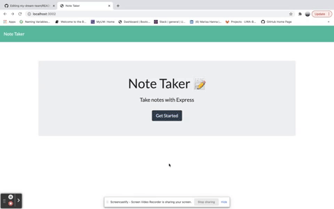
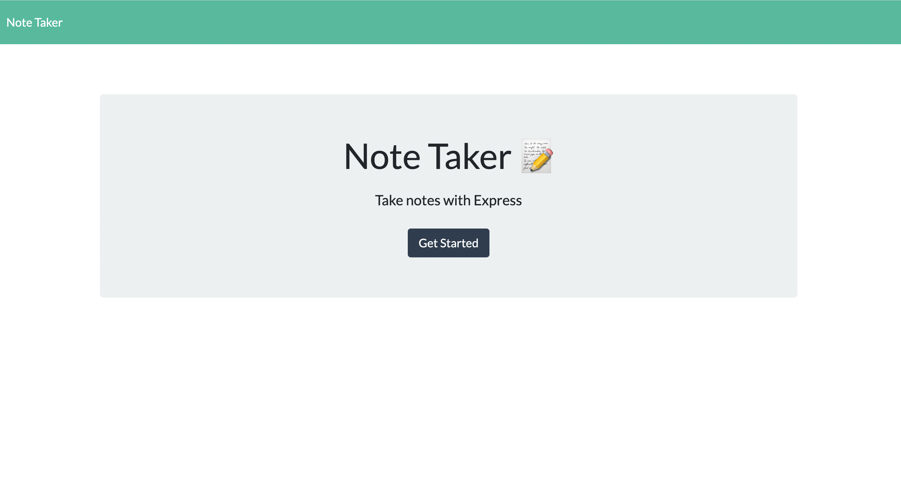
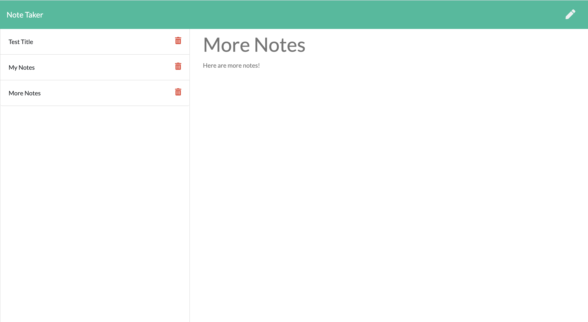

#       Note Taker By Express

#       Decsription

        The purpose of this application is to allow the user to write notes in order to organize their busy schedule. The text content is saved to a JSON file in a server-side database for persistent storage. The user can then delete the tasks that have been completed throughout their day.

#       Images

#       Dependencies 

         This project uses npm Express to provide sever-side logic for this application.

#       Languages Used

        *HTML
        *CSS
        *JavaScript
        *Node.js

#       Contributors 

        Marisa Hanna

#       Link to Deployed Application

[Heroku Link](https://aqueous-wildwood-29107.herokuapp.com/)

